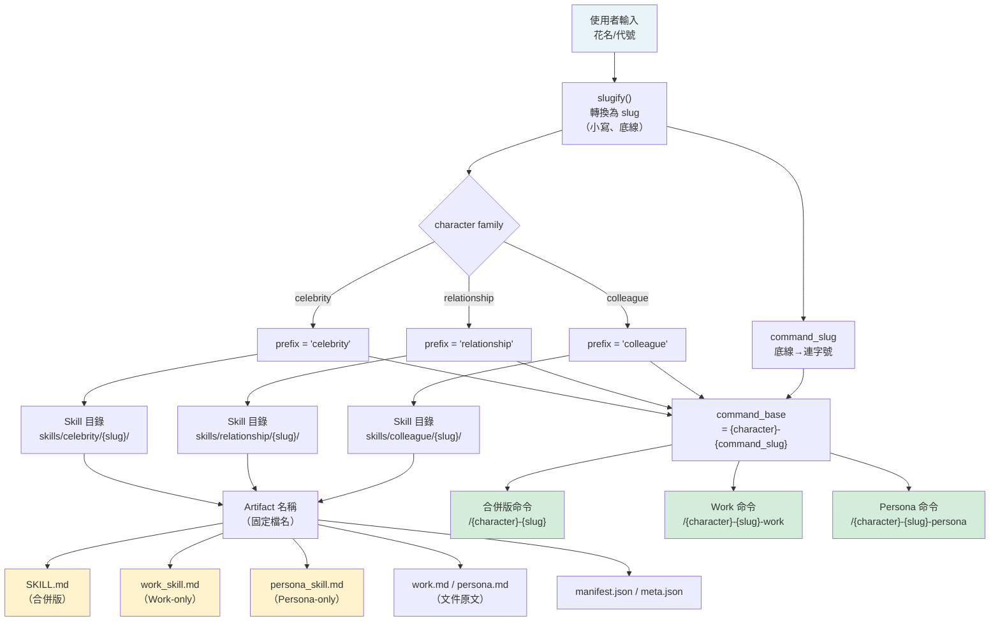

# API_SURFACE — dot-skill API 與介面參考文件

> 版本：基於 SKILL.md v1.0.0 / schema_version 3  
> 更新日期：2026-04-27  
> 語言：繁體中文，專業術語保留英文原文

---

## 目錄

1. [Skill 調用介面（Agent Host 使用者）](#1-skill-調用介面)
2. [Python CLI 介面（開發者）](#2-python-cli-介面)
3. [manifest.json 格式](#3-manifestjson-格式)
4. [採集器標準介面（共用參數模式）](#4-採集器標準介面)
5. [Feishu API 端點速查](#5-feishu-api-端點速查)
6. [Error Handling](#6-error-handling)
7. [Skill 命名規則 Mermaid 圖](#7-skill-命名規則)

---

## 1. Skill 調用介面

### 1.1 主入口觸發詞

在支援 slash command 的宿主（Claude Code / OpenClaw / Hermes）中，以 `/` 前置觸發；Codex 無 slash 機制，以 skill 名稱呼叫。

**中文觸發詞**（`SKILL.md:22-29`）：

| 觸發詞 | 說明 |
|--------|------|
| `/dot-skill` | 標準入口（所有宿主） |
| `帮我创建一个 skill` | 自然語言觸發 |
| `我想蒸馏一个人` | 自然語言觸發 |
| `新建一个 skill` | 自然語言觸發 |
| `给我做一个 XX 的 skill` | 自然語言觸發 |

**英文觸發詞**（`SKILL.md:750-753`）：

| 觸發詞 | 說明 |
|--------|------|
| `/dot-skill` | 標準入口 |
| `Help me create a skill` | 自然語言觸發 |
| `I want to distill someone` | 自然語言觸發 |
| `Create a new skill` | 自然語言觸發 |
| `Make a skill for XX` | 自然語言觸發 |

> Hermes 宿主：僅 `/dot-skill` 保證穩定路由；`colleague`、`relationship`、`celebrity` 名稱不保證在 Hermes slash command 層可路由。

---

### 1.2 合併版 / Work-only / Persona-only 命令

生成的角色 Skill 安裝後，以下命令可直接呼叫已生成的 Skill（`tools/skill_schema.py:108-123`）：

| 格式 | 範例 | 說明 |
|------|------|------|
| `/{character}-{slug}` | `/colleague-zhangsan` | 合併版（Work + Persona） |
| `/{character}-{slug}-work` | `/colleague-zhangsan-work` | 僅 Work Skill |
| `/{character}-{slug}-persona` | `/colleague-zhangsan-persona` | 僅 Persona Skill |

其中 `{character}` 為 `colleague` / `relationship` / `celebrity`，`{slug}` 中底線（`_`）替換為連字號（`-`）。

---

### 1.3 進化模式觸發詞

**中文進化模式**（`SKILL.md:39-44`）：

| 觸發詞 | 用途 |
|--------|------|
| `我有新文件` / `追加` | 追加新文件，增量更新 |
| `这不对` / `他不会这样` / `他应该是` | 對話糾正模式 |
| `/update-skill {character} {slug}` | CLI 風格顯式更新 |
| `/update-colleague {slug}` | 向後相容別名（colleague 專用） |

**英文進化模式**（`SKILL.md:764-770`）：

| 觸發詞 | 用途 |
|--------|------|
| `I have new files` / `append` | 追加新文件 |
| `That's wrong` / `He wouldn't do that` / `He should be` | 對話糾正 |
| `/update-skill {character} {slug}` | CLI 風格顯式更新 |
| `/update-colleague {slug}` | 向後相容別名 |

---

## 2. Python CLI 介面

所有工具均需在 skill repo 根目錄下執行（`python3 tools/...`）。

---

### 2.1 `tools/skill_writer.py`

> 核心 artifact 寫入工具，來源：`tools/skill_writer.py:497-544`

```
python3 tools/skill_writer.py --action <ACTION> [OPTIONS]
```

**必填參數：**

| 參數 | 值 | 說明 |
|------|----|------|
| `--action` | `create` \| `update` \| `list` | 操作類型 |

**建立/更新通用參數：**

| 參數 | 預設值 | 說明 |
|------|--------|------|
| `--slug` | — | Skill slug（輸出目錄名稱） |
| `--name` | — | 顯示名稱 |
| `--character` | `colleague` | Character family preset |
| `--research-profile` | — | Celebrity 研究模式（`budget-friendly` / `budget-unfriendly`） |
| `--type` | — | ⚠️ 已廢棄，`--character` 的相容別名 |
| `--meta` | — | 元數據 JSON 檔案路徑 |
| `--work` | — | `work.md` 內容檔案路徑（create 用） |
| `--persona` | — | `persona.md` 內容檔案路徑（create 用） |
| `--work-patch` | — | Work 增量 patch 檔案路徑（update 用） |
| `--persona-patch` | — | Persona 增量 patch 檔案路徑（update 用） |
| `--correction-json` | — | 對話糾正 JSON 檔案路徑（update 用） |
| `--base-dir` | — | Skill 儲存根目錄 |

**安裝控制參數：**

| 參數 | 說明 |
|------|------|
| `--install-claude-skill` | 建立/更新後安裝到 Claude Code |
| `--no-install-claude-skill` | 跳過 Claude Code 安裝 |
| `--install-claude-command-shim` | 額外安裝 Windows 相容 slash-command shim |
| `--claude-skills-dir` | 覆寫 Claude Code skills 目錄 |
| `--claude-commands-dir` | 覆寫 Claude Code commands 目錄 |
| `--install-openclaw-skill` | 建立/更新後安裝到 OpenClaw |
| `--openclaw-skills-dir` | 覆寫 OpenClaw skills 目錄 |
| `--install-codex-skill` | 建立/更新後安裝到 Codex |
| `--codex-skills-dir` | 覆寫 Codex skills 目錄 |

> 環境變數：`DOT_SKILL_AUTO_INSTALL_CLAUDE=0` 可停用預設自動安裝 Claude Code（`skill_writer.py:547`）。

---

### 2.2 `tools/version_manager.py`

> 版本備份與回滾工具，來源：`tools/version_manager.py:137-145`

```
python3 tools/version_manager.py --action <ACTION> --slug <SLUG> [OPTIONS]
```

| 參數 | 必填 | 說明 |
|------|------|------|
| `--action` | 是 | `list` \| `backup` \| `rollback` \| `cleanup` |
| `--slug` | 是 | Skill slug |
| `--character` | 否（預設 `colleague`） | Character family |
| `--type` | 否 | ⚠️ 已廢棄，`--character` 相容別名 |
| `--version` | rollback 必填 | 目標版本號（如 `v2`） |
| `--base-dir` | 否 | Skill 儲存根目錄 |

> 最多保留 `MAX_VERSIONS = 10` 個備份版本（`version_manager.py:21`）。

---

### 2.3 `tools/feishu_auto_collector.py`

> 飛書自動採集器，來源：`tools/feishu_auto_collector.py:890-900`

```
python3 tools/feishu_auto_collector.py [OPTIONS]
```

| 參數 | 說明 |
|------|------|
| `--setup` | 初始化配置（App ID / App Secret，一次性） |
| `--name <姓名>` | 目標同事姓名 |
| `--output-dir <DIR>` | 輸出目錄（預設 `./knowledge/{name}`） |
| `--msg-limit <N>` | 最多採集訊息條數（預設 `1000`） |
| `--doc-limit <N>` | 最多採集文件篇數（預設 `20`） |
| `--exchange-code <CODE>` | 用 OAuth 授權碼換取 `user_access_token` |
| `--user-token <TOKEN>` | 直接指定 `user_access_token`（覆寫配置） |
| `--p2p-chat-id <CHAT_ID>` | 私聊會話 ID（格式 `oc_xxx`） |
| `--open-id <OPEN_ID>` | 直接指定目標用戶 `open_id`（跳過用戶搜索） |

---

### 2.4 `tools/slack_auto_collector.py`

> Slack 自動採集器，來源：`tools/slack_auto_collector.py:652-684`

```
python3 tools/slack_auto_collector.py [OPTIONS]
```

| 參數 | 說明 |
|------|------|
| `--setup` | 初始化配置（Bot Token） |
| `--name <姓名>` | 目標同事姓名或 Slack 用戶名 |
| `--output-dir <DIR>` | 輸出目錄（預設 `./knowledge/{name}`） |
| `--msg-limit <N>` | 最多採集訊息條數 |
| `--channel-limit <N>` | 最多檢查頻道數 |

---

### 2.5 `tools/research/merge_research.py`

> Celebrity 研究筆記合併工具，來源：`tools/research/merge_research.py:268-270`

```
python3 tools/research/merge_research.py <PATH>
```

| 參數 | 說明 |
|------|------|
| `path`（位置參數） | Skill 目錄或 research 目錄路徑 |

輸出：`knowledge/research/merged/summary.md`

---

### 2.6 `tools/research/quality_check.py`

> Skill 品質驗證工具，來源：`tools/research/quality_check.py:225-233`

```
python3 tools/research/quality_check.py <PATH> [--profile PROFILE] [--json]
```

| 參數 | 說明 |
|------|------|
| `path`（位置參數） | `SKILL.md` 路徑或包含 `SKILL.md` 的目錄路徑 |
| `--profile` | `budget-friendly`（預設）\| `budget-unfriendly` |
| `--json` | 以 JSON 格式輸出報告 |

---

### 2.7 `tools/install_hermes_skill.py`（及同系列安裝器）

> Meta-skill 宿主安裝器，來源：`tools/install_hermes_skill.py:33-46`

```
python3 tools/install_hermes_skill.py [OPTIONS]
```

| 參數 | 預設值 | 說明 |
|------|--------|------|
| `--source` | repo 根目錄 | 來源 skill repo 根目錄 |
| `--dest` | `~/.hermes/skills/openclaw-imports/dot-skill/` | 目的地目錄 |
| `--force` | — | 覆蓋已存在的目的地 |
| `--dry-run` | — | 僅輸出目標路徑，不實際複製 |

各宿主安裝器的預設 `--dest`：

| 安裝器 | 預設安裝目標 |
|--------|------------|
| `install_hermes_skill.py` | `~/.hermes/skills/openclaw-imports/dot-skill/` |
| `install_openclaw_skill.py` | `~/.openclaw/workspace/skills/dot-skill/` |
| `install_codex_skill.py` | `~/.codex/skills/dot-skill/` |

---

### 2.8 `tools/install_claude_generated_skill.py`（及同系列）

> 已生成角色 Skill 安裝器，來源：`tools/install_claude_generated_skill.py:71-89`

```
python3 tools/install_claude_generated_skill.py --skill-dir <DIR> [OPTIONS]
```

| 參數 | 說明 |
|------|------|
| `--skill-dir` | 已生成的 Skill 目錄路徑（必填） |
| `--claude-skills-dir` | 目標 Claude Code skills 目錄 |
| `--claude-commands-dir` | 目標 Claude Code commands 目錄 |
| `--force` | 覆蓋已安裝的 Skill |
| `--dry-run` | 解析安裝路徑但不寫入檔案 |
| `--install-command-shim` | 同時在 `~/.claude/commands` 安裝 slash-command shim（Windows 相容） |

---

## 3. manifest.json 格式

由 `tools/skill_schema.py:build_manifest()` 函式（第 251-300 行）生成，供 Gallery 和安裝器使用。

```json
{
  "manifest_version": "1",
  "id": "<kind>.<character>.<slug>",
  "kind": "meta-skill",
  "character": "colleague | relationship | celebrity",
  "research_profile": "standard | budget-friendly | budget-unfriendly",
  "preset": "<preset_name>",
  "display_name": "<人物顯示名稱>",
  "entrypoints": {
    "default": "SKILL.md",
    "work":    "work_skill.md",
    "persona": "persona_skill.md"
  },
  "artifacts": [
    "SKILL.md",
    "work_skill.md",
    "persona_skill.md",
    "meta.json",
    "manifest.json"
  ],
  "capabilities": ["persona", "work"],
  "engine": {
    "name": "dot-skill",
    "kind": "meta-skill",
    "character": "<character>",
    "preset": "<preset_name>",
    "prompt_bundle": {},
    "research_profile": "standard",
    "research_profile_bundle": {},
    "research_profile_references": [],
    "merge_strategy": "compact",
    "quality_profile": "budget-friendly",
    "research_tools": {},
    "knowledge_dirs": []
  },
  "toolchain": {
    "prompt_bundle": {},
    "research_profile": "standard",
    "research_profile_bundle": {},
    "research_profile_references": [],
    "merge_strategy": "compact",
    "quality_profile": "budget-friendly",
    "research_tools": {},
    "knowledge_dirs": []
  },
  "install": {
    "compatible_runtimes": ["claude-code", "openclaw", "hermes", "codex"],
    "min_schema_version": "3",
    "installers": {
      "claude-code": "tools/install_claude_generated_skill.py",
      "openclaw":    "tools/install_openclaw_generated_skill.py",
      "codex":       "tools/install_codex_generated_skill.py"
    },
    "slash_commands": {
      "default": "<character>-<slug>",
      "work":    "<character>-<slug>-work",
      "persona": "<character>-<slug>-persona"
    }
  }
}
```

**欄位說明：**

| 欄位 | 型別 | 說明 |
|------|------|------|
| `manifest_version` | string | 固定為 `"1"` |
| `id` | string | 唯一識別符，格式 `{kind}.{character}.{slug}` |
| `kind` | string | 固定為 `"meta-skill"` |
| `character` | string | `colleague` / `relationship` / `celebrity` |
| `research_profile` | string | Celebrity 研究模式；非 celebrity 時為 `"standard"` |
| `preset` | string | Character preset 名稱（來自 `skill_presets.py`） |
| `display_name` | string | 人物顯示名稱 |
| `entrypoints` | object | 三個 Skill 進入點（default / work / persona） |
| `artifacts` | array | 本 Skill 目錄下的主要檔案清單 |
| `capabilities` | array | 固定 `["persona", "work"]` |
| `engine` | object | 生成引擎元資訊 |
| `toolchain` | object | 工具鏈配置（prompt_bundle, merge_strategy 等） |
| `install` | object | 安裝元資訊，含相容 runtime、安裝器路徑、slash commands |

---

## 4. 採集器標準介面

歸納 `feishu_auto_collector.py`、`slack_auto_collector.py`、`dingtalk_auto_collector.py` 的共用參數模式：

| 參數 | 型別 | 出現於 | 說明 |
|------|------|--------|------|
| `--name` | string | 全部採集器 | 目標人物姓名（採集查詢條件） |
| `--output-dir` | string | Feishu / Slack / ⚠️DingTalk | 輸出目錄；預設 `./knowledge/{name}` |
| `--setup` | flag | 全部採集器 | 首次配置入口（互動式設定 token/credential） |
| `--msg-limit` | int | Feishu / Slack | 最多採集訊息條數；Feishu 預設 `1000`，Slack 視常數 |
| `--doc-limit` | int | Feishu | 最多採集文件篇數；預設 `20` |
| `--channel-limit` | int | Slack | 最多檢查頻道數 |

> ⚠️ `dingtalk_auto_collector.py` 的 `--output-dir` 預設行為未在本次分析中完整確認，推測與 Feishu 相同。

---

## 5. Feishu API 端點速查

來源：`tools/feishu_auto_collector.py` + `.trace/_context/integrations.md`

Base URL：`https://open.feishu.cn/open-apis`

| Endpoint | Method | 用途 | 認證方式 |
|----------|--------|------|---------|
| `/auth/v3/app_access_token/internal` | POST | 取得 `tenant_access_token` | `app_id` + `app_secret` |
| `/authen/v1/authorize` | GET（瀏覽器重新導向） | OAuth 授權入口，取得 `code` | `app_id` + `redirect_uri` |
| `/authen/v1/oidc/access_token` | POST | 用 OAuth `code` 換取 `user_access_token` | `app_access_token` + `code` |
| `/im/v1/messages` | GET | 拉取群聊訊息（`container_id_type=chat`） | `tenant_access_token` |
| `/im/v1/messages` | POST | 發訊息（用於取得 p2p `chat_id`） | `user_access_token` |
| `/contact/v3/scopes` | GET | 取得通訊錄可見範圍 | `tenant_access_token` |
| `/contact/v3/users/{user_id}` | GET | 查詢用戶詳細資訊 | `tenant_access_token` |

**認證流程摘要：**

- **群聊採集**：`app_id + app_secret` → `tenant_access_token` → IM API
- **私聊採集**：OAuth 授權 → `code` → `user_access_token`（有效期 2 小時）→ 私聊 API
- **瀏覽器方案**：Playwright 複用本機 Chrome 登入態，繞過 API token 限制（`tools/feishu_browser.py`）
- **MCP 方案**：透過 `feishu-mcp` npm 套件（需 Node.js 16+）讀取文件（`tools/feishu_mcp_client.py`）

---

## 6. Error Handling

### Exit Codes

| 工具 | Exit Code | 條件 |
|------|-----------|------|
| `skill_writer.py` | `0` | 成功 |
| `skill_writer.py` | `1` | `create/update` 時缺少 `--slug` 且 `--name` 也未提供（`skill_writer.py:573-574`） |
| `skill_writer.py` | `1` | update 時 Skill 目錄不存在（`skill_writer.py:615-616`） |
| `version_manager.py` | `0` | 成功 |
| `version_manager.py` | `1` | Skill 目錄不存在（`version_manager.py:151-153`） |
| `version_manager.py` | `1` | `rollback` 時缺少 `--version`（`version_manager.py:173-175`） |
| `feishu_auto_collector.py` | `1` | `requests` 套件未安裝（`feishu_auto_collector.py:56`） |
| `feishu_auto_collector.py` | `1` | 配置未初始化（`feishu_auto_collector.py:67-68`） |
| `feishu_auto_collector.py` | `1` | 取得 token 失敗（`feishu_auto_collector.py:144-145`） |
| `feishu_auto_collector.py` | `1` | 採集主流程失敗（`feishu_auto_collector.py:848`） |
| `slack_auto_collector.py` | `0` | 成功（含無訊息的正常結束，`slack_auto_collector.py:715`） |
| `slack_auto_collector.py` | `1` | `slack-sdk` 套件未安裝 / 配置未初始化 / 採集失敗（多處） |

### 錯誤訊息格式

所有錯誤訊息均輸出至 `stderr`，格式為：

```
error: <描述>
```

或工具特定的中文提示，例如：

```
错误：请先安装 requests：pip3 install requests
未找到配置，请先运行：python3 feishu_auto_collector.py --setup
error: create requires --slug or --name
error: skill directory not found: ./skills/colleague/zhangsan
error: rollback requires --version
```

> ⚠️ 以上 exit code 清單為程式碼掃描結果，各工具並無正式 exit code 文件，`exit(0)` 亦可能表示「部分採集成功但無結果」（如 Slack 無訊息時）。

---

## 7. Skill 命名規則

下圖展示從輸入 `slug` 到各 artifact 名稱及 slash command 名稱的完整映射關係（`tools/skill_schema.py:103-123`，`tools/skill_presets.py`）。



**範例**：

| 輸入 | slug | character | 合併命令 | work 命令 | persona 命令 |
|------|------|-----------|---------|-----------|-------------|
| `张三` → slugify | `zhang_san` | `colleague` | `/colleague-zhang-san` | `/colleague-zhang-san-work` | `/colleague-zhang-san-persona` |
| `Elon Musk` → slugify | `elon_musk` | `celebrity` | `/celebrity-elon-musk` | `/celebrity-elon-musk-work` | `/celebrity-elon-musk-persona` |

---

*本文件由 `.trace/_context/` 下的偵察報告自動彙整，程式碼引用已標注具體檔案路徑與行號。帶 ⚠️ 標記的項目為推測或未正式文件化的部分，請以實際程式碼為準。*
