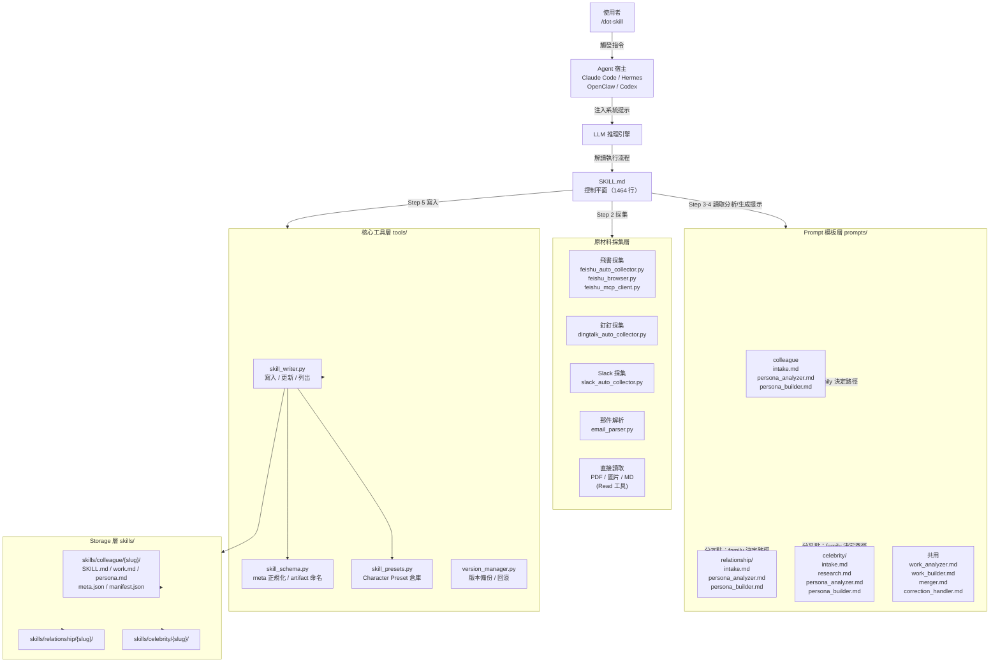
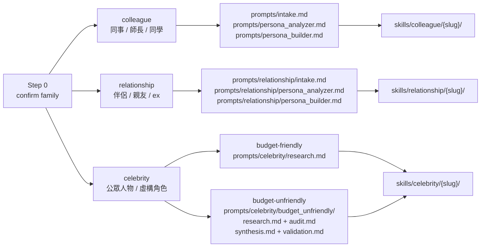
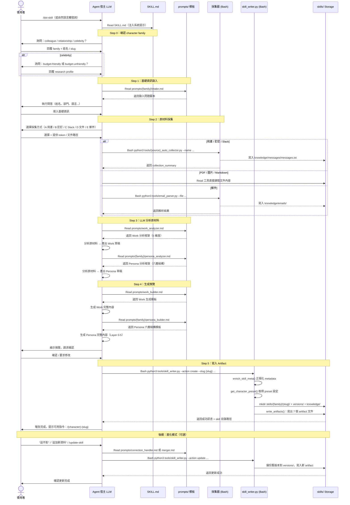

# dot-skill 系統架構文件

> 版本：1.0.0 | 更新日期：2026-04-27 | 基於 colleague-skill repo 現況分析

---

## 1. 高層架構概覽

dot-skill 是一個符合 **AgentSkills 標準**的 meta-skill，讓 AI Agent 宿主能夠把真實人物（同事、親友、公眾人物）蒸餾成可複用的 character Skill。整體設計圍繞三個核心原則：

1. **AI 為控制平面**：SKILL.md 是 Markdown 格式的指令集，而非可執行程式
2. **Python 為執行平面**：所有 I/O 操作（採集、寫檔、版本管理）由 tools/ 下的 Python 腳本負責
3. **Prompt 模板為知識平面**：分析邏輯和生成策略封裝在 prompts/ 目錄，完全解耦於執行層

### 1.1 整體架構圖



### 1.2 Character Family 分叉點

使用者在 Step 0 確認 character family 後，系統進入三條平行路徑：



---

## 2. 元件清單

| 元件 | 職責 | 關鍵檔案 / 目錄 | 上游依賴 | 下游依賴 |
|------|------|----------------|---------|---------|
| **SKILL.md** | 主控指令集，定義完整蒸餾流程 | `SKILL.md`（1464 行）| Agent 宿主 | prompts/、tools/ |
| **Character Preset 倉庫** | 管理三個 family 的路徑、prompt 綁定、品質門檻 | `tools/skill_presets.py` | - | skill_writer.py、skill_schema.py |
| **Metadata Schema** | 元數據正規化、artifact 命名策略、向後相容 | `tools/skill_schema.py` | skill_presets.py | skill_writer.py |
| **Skill Writer** | Artifact 寫入、增量更新、Correction 應用 | `tools/skill_writer.py` | skill_schema.py、skill_presets.py | skills/ Storage |
| **Version Manager** | 版本備份、回滾、清理（最多 10 版） | `tools/version_manager.py` | - | skills/{family}/{slug}/versions/ |
| **Prompt 模板庫** | 分析邏輯與生成策略（純 Markdown） | `prompts/`（共用）、`prompts/relationship/`、`prompts/celebrity/` | - | SKILL.md（動態引用） |
| **飛書採集器** | 三種模式：API 自動 / 瀏覽器登入態 / MCP App Token | `tools/feishu_auto_collector.py`、`feishu_browser.py`、`feishu_mcp_client.py` | requests、playwright | skills/ Storage |
| **釘釘採集器** | API + 瀏覽器雙模式採集 | `tools/dingtalk_auto_collector.py` | requests | skills/ Storage |
| **Slack 採集器** | slack-sdk 自動採集 | `tools/slack_auto_collector.py` | slack-sdk | skills/ Storage |
| **郵件解析器** | 解析 .eml / .mbox 格式 | `tools/email_parser.py` | - | skills/ Storage |
| **Celebrity 研究工具鏈** | 字幕下載、音訊轉文字、六維度筆記合併、品質驗證 | `tools/research/`（6 個工具） | yt-dlp（外部）、pypinyin | skills/celebrity/ |
| **Host 安裝器** | 將 dot-skill 本身或已生成 Skill 安裝到各宿主 | `tools/install_*_skill.py`（9 個） | install_generated_skill_common.py | 各 Agent 宿主設定目錄 |
| **Storage 層** | 保存最終 artifact 集，結構化目錄 | `skills/colleague/`、`skills/relationship/`、`skills/celebrity/` | skill_writer.py | Agent 宿主（使用已生成 Skill）|

---

## 3. 分層設計說明

dot-skill 的架構從上到下分為四個層次：

### Layer 0 — AgentSkills 標準層（SKILL.md 入口）

**職責：** 定義 AI Agent 的行為邊界與指令集。

SKILL.md 以 YAML frontmatter 聲明 meta 資訊（`name`, `version`, `allowed-tools`），其餘為 Markdown 格式的流程指令。Agent 宿主讀取此檔案後，將其注入 LLM 作為系統提示。

```
# SKILL.md 關鍵 frontmatter（第 1-7 行）
name: dot-skill
version: "1.0.0"
user-invocable: true
allowed-tools: Read, Write, Edit, Bash
```

這一層**不包含**任何業務邏輯程式碼，只有自然語言指令。執行時的「決策者」是 LLM，「執行者」是宿主提供的工具（Read / Write / Edit / Bash）。

### Layer 1 — Prompt 模板層（prompts/ 目錄）

**職責：** 封裝分析策略與生成規則，解耦於執行層。

Prompt 模板是**純 Markdown 文件**，在 SKILL.md 流程中被動態引用（LLM 執行 `Read prompts/xxx.md`，然後依照模板內容執行分析）。

目錄結構反映 character family 的分叉：

```
prompts/
├── intake.md                # colleague 資訊錄入
├── work_analyzer.md         # 共用：Work 分析（5 維度提取）
├── persona_analyzer.md      # colleague：Persona 分析
├── work_builder.md          # 共用：Work 生成模板
├── persona_builder.md       # colleague：Persona 六層結構生成
├── merger.md                # 共用：增量合併策略
├── correction_handler.md    # 共用：對話糾正識別
├── relationship/            # relationship family 專用
│   ├── intake.md
│   ├── persona_analyzer.md
│   ├── persona_builder.md
│   └── merger.md
└── celebrity/               # celebrity family 專用
    ├── intake.md
    ├── research.md          # budget-friendly 六維度研究策略
    ├── persona_analyzer.md
    ├── persona_builder.md
    ├── merger.md
    └── budget_unfriendly/   # 深度研究子路徑
        ├── research.md
        ├── audit.md
        ├── synthesis.md
        ├── validation.md
        ├── persona_analyzer.md
        └── persona_builder.md
```

替換任何模板文件**不影響** Python 工具層，提供低風險的迭代能力。

### Layer 2 — 工具執行層（tools/ 目錄）

**職責：** 負責所有具體的 I/O 操作，Python 實作，透過 Bash 工具呼叫。

核心工具三件組：

| 工具 | 核心函式 | 職責 |
|------|---------|------|
| `skill_writer.py` | `create_skill()` / `update_skill()` / `apply_correction()` | Artifact 生命週期管理 |
| `skill_schema.py` | `enrich_skill_meta()` / `build_artifact_names()` | 元數據正規化與 artifact 命名 |
| `skill_presets.py` | `get_character_preset()` / `CHARACTER_PRESETS` | Character preset 倉庫 |

**Markdown Patch 合併演算法**（`skill_writer.py:merge_markdown_patch()`，第 264-299 行）：
增量更新時以 `##` 節標題為最小單位比對，找到則替換整節，找不到則附加，避免解析複雜的 SKILL.md 結構。

**語言感知渲染**（`skill_writer.py:prefers_chinese()`，第 143-145 行）：
根據 `meta.classification.language` 欄位，選擇中文或英文模板渲染 combined SKILL.md。

### Layer 3 — Storage 層（skills/ 目錄）

**職責：** 持久化所有 artifact，每個人物一個獨立子目錄。

每個生成的 Skill 目錄包含完整的 artifact 集：

```
skills/{family}/{slug}/
├── SKILL.md          # Combined Skill（Persona + Work + 運行規則）→ /{character}-{slug}
├── work_skill.md     # Work-only Skill（帶 frontmatter）→ /{character}-{slug}-work
├── persona_skill.md  # Persona-only Skill（帶 frontmatter）→ /{character}-{slug}-persona
├── work.md           # Work 原始內容（無 frontmatter，供 merger 讀取）
├── persona.md        # Persona 原始內容（無 frontmatter，供 merger 讀取）
├── manifest.json     # 機器可讀 metadata（安裝器 / Gallery 使用）
├── meta.json         # 完整 metadata（version_manager / skill_writer 使用）
├── versions/         # 歷史版本備份（最多 10 個）
└── knowledge/        # 原材料儲存
    ├── docs/
    ├── messages/
    └── emails/
```

---

## 4. 通訊模式

### 4.1 同步 LLM 呼叫

```
使用者訊息
    → Agent 宿主 LLM（系統提示 = SKILL.md 全文）
    → LLM 產出「工具呼叫」請求（Read / Write / Bash）
    → 宿主執行工具
    → 工具結果回饋 LLM
    → LLM 繼續下一步
```

整個流程是**單執行緒的同步對話循環**，無非同步佇列或 message broker。

### 4.2 Bash 工具呼叫慣例

SKILL.md 中所有 Python 呼叫均使用 `Bash` 工具，格式固定：

```bash
python3 tools/skill_writer.py --action create \
    --slug {slug} --character {character} \
    --work-file /tmp/work.md --persona-file /tmp/persona.md
```

採集器輸出寫入 `skills/{family}/{slug}/knowledge/messages/messages.txt`，然後 LLM 再用 `Read` 工具讀回分析。

### 4.3 Prompt 模板動態載入

LLM 在執行分析步驟前，先用 `Read` 工具讀取對應 prompt 模板，再按模板內容進行推理。這種「**即時載入**」方式使得修改 prompt 無需重啟或重新安裝，下次呼叫時立即生效。

---

## 5. 關鍵設計決策與 Trade-off

### 5.1 整個 repo 是單一 Skill 目錄（AgentSkills 設計）

**決策：** 遵循 AgentSkills 標準，repo 根目錄 = skill 目錄，`SKILL.md` 放在根部。

**優點：**
- Agent 宿主只需 `git clone` 即可安裝，無需額外建置步驟
- 支援多個宿主（Claude Code / Hermes / OpenClaw / Codex）共用同一 codebase
- `allowed-tools` 聲明讓宿主知道需要哪些工具授權

**Trade-off：**
- tools/ 和 prompts/ 的路徑必須相對於 SKILL.md 所在目錄，無法任意移動
- 測試環境需要模擬 skill root 的目錄結構

### 5.2 Markdown Prompt 模板 vs 程式碼硬編碼

**決策：** 分析邏輯和生成規則全部放在 `prompts/` 目錄的 Markdown 文件中，不硬編碼在 Python。

**優點：**
- Prompt 迭代不需修改 Python 程式碼，降低回歸風險
- 支援非技術用戶直接編輯 prompt 模板客製化行為
- 不同 family（colleague / relationship / celebrity）共享相同執行層，只換 prompt bundle

**Trade-off：**
- SKILL.md 必須記住每個 step 要讀哪個 prompt 文件，若路徑錯誤會靜默失敗
- Prompt 版本控制依賴 git history，無獨立版本追蹤機制

### 5.3 Artifact 分離設計（raw content vs rendered skill）

**決策：** 每個生成 Skill 同時儲存 raw content（`work.md` / `persona.md`）和 rendered skill（`work_skill.md` / `SKILL.md`）。

**優點：**
- 增量更新只需 patch raw content 再重新 render，不需解析已渲染的 SKILL.md
- merger prompt 可以直接讀取 `work.md` + `persona.md`，無需剝除 frontmatter
- 分開使用場景：Combined SKILL.md 給對話用，Work-only / Persona-only 給專項任務用

**Trade-off：**
- 每次更新需同步寫出 7 個 artifact 檔案（`write_artifacts()` 第 197-223 行）
- 儲存空間略增，但內容本身不大，實際影響可忽略

### 5.4 Character Preset 系統的擴展性設計

**決策：** 所有 family 差異集中在 `CHARACTER_PRESETS` 字典（`skill_presets.py` 第 23 行），核心流程不感知具體 family。

**優點：**
- 新增 character family 只需在字典加一個 key + 建立對應 prompts/ 子目錄
- `CHARACTER_ALIASES`（第 170-178 行）支援語義別名（`"ex" → "relationship"`, `"icon" → "celebrity"`），向後相容
- Celebrity 的 `research_profiles` 子系統示範了 preset 內的進一步分叉能力

**Trade-off：**
- Preset 字典目前無 schema 驗證，新增 family 時若缺欄位只在執行時才報錯
- ⚠️ 未驗證：`CHARACTER_ALIASES["self"] = "relationship"` 意味著「蒸餾自己」目前使用情感關係的 prompts，可能語意不完全吻合

---

## 6. 完整執行流程 Sequence Diagram



---

## 7. 附錄：關鍵常數與設定

| 項目 | 值 | 位置 |
|------|-----|------|
| 最大版本保留數 | `MAX_VERSIONS = 10` | `tools/version_manager.py:21` |
| 預設 research profile | `"budget-friendly"` | `tools/skill_presets.py:20` |
| budget-friendly 最低 raw notes | 3 | `skill_presets.py:研究門檻` |
| budget-unfriendly 最低 raw notes | 6 | `skill_presets.py:研究門檻` |
| Artifact 數量（每個 Skill） | 7 個文件 | `skill_writer.py:write_artifacts()` |
| Python 最低版本 | 3.9+ | `requirements.txt`, CI `ci.yml` |
| 必選 Python 依賴 | `requests>=2.28.0` | `requirements.txt` |
| 可選依賴 | `pypinyin`, `playwright`, `slack-sdk`, `python-docx`, `openpyxl` | `requirements.txt` |

---

*本文件由 Claude Code 依據 `.trace/_context/` 分析結果自動生成，程式碼引用均標注具體行號。如 codebase 有重大重構，請重新執行 trace 流程更新本文件。*
