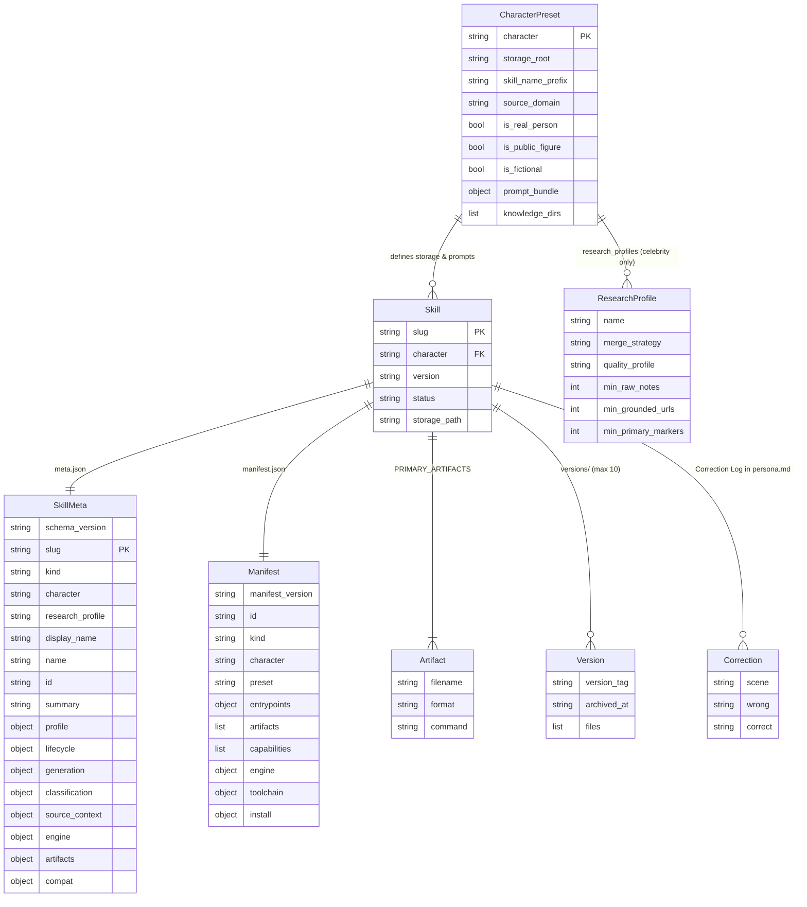
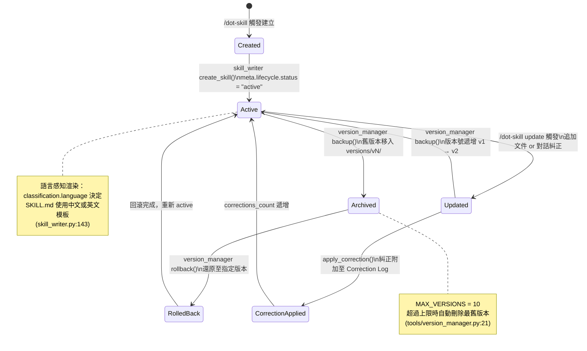

# dot-skill 資料模型文件

> 文件版本：1.0 | 產出日期：2026-04-27 | Schema Version：3

---

## 1. 核心 Entity 清單

| Entity | 儲存位置 | 說明 |
|--------|----------|------|
| **Skill** | `skills/{character}/{slug}/` | 一個完整生成的人物 Skill 目錄 |
| **SkillMeta** | `skills/{character}/{slug}/meta.json` | 完整元數據（含版本、分類、生成設定） |
| **Manifest** | `skills/{character}/{slug}/manifest.json` | 機器可讀安裝/Gallery 元數據 |
| **CharacterPreset** | `tools/skill_presets.py:CHARACTER_PRESETS` | 各 family 的 Prompt、目錄、語義屬性定義 |
| **Artifact** | `skills/{character}/{slug}/*.md` | 生成的文件集合（SKILL.md、work.md 等） |
| **Version** | `skills/{character}/{slug}/versions/{vN}/` | 歷史版本存檔（上限 MAX_VERSIONS=10） |
| **Correction** | `persona.md` 的 `## Correction Log` 節 | 對話糾正記錄，格式 `{scene, wrong, correct}` |

---

## 2. ER Diagram



---

## 3. meta.json Schema 詳細說明

> 來源：`tools/skill_schema.py:enrich_skill_meta()`（第 153-248 行）

### 3.1 頂層欄位

| 欄位 | 型別 | 說明 | 預設值 |
|------|------|------|--------|
| `schema_version` | string | Schema 版本號 | `"3"` |
| `slug` | string | URL-safe 唯一識別碼（底線分隔） | 必填 |
| `kind` | string | Skill 類型 | `"meta-skill"` |
| `character` | string | Character family（`colleague`/`relationship`/`celebrity`） | `"colleague"` |
| `research_profile` | string | 研究策略（`standard`/`budget-friendly`/`budget-unfriendly`） | `"budget-friendly"` |
| `subtype` | string \| null | 子類型（保留欄位） | `null` |
| `preset` | string | Prompt bundle 識別碼（如 `dot.colleague.v1`） | 由 preset 決定 |
| `display_name` | string | 顯示用姓名 | slug 值 |
| `name` | string | 內部姓名（相容用） | display_name |
| `id` | string | 全域唯一 ID，格式 `{kind}.{character}.{slug}` | 自動生成 |
| `summary` | string | 單行摘要（姓名 + 身份） | 自動生成 |
| `type` | string | 舊版相容欄位（同 character） | 由 preset 決定 |
| `profile` | object | 人物屬性（company, level, role, gender, mbti 等） | `{}` |
| `impression` | string | 第一印象描述 | `""` |
| `knowledge_sources` | list | 原始資料來源列表 | `[]` |
| `corrections_count` | int | 糾正次數計數 | `0` |
| `tags` | object | 舊版 personality/culture 標籤（向後相容） | `{}` |

### 3.2 `lifecycle` 子物件

> 來源：`skill_schema.py:153` 的 `lifecycle` setdefault 區段

| 欄位 | 型別 | 說明 | 預設值 |
|------|------|------|--------|
| `status` | string | 生命週期狀態（`active`/`archived`） | `"active"` |
| `created_at` | string | ISO 8601 UTC 建立時間 | 建立當下時間 |
| `updated_at` | string | ISO 8601 UTC 最後更新時間 | 同 created_at |
| `version` | string | 目前版本（`v1`, `v2`, ...） | `"v1"` |

### 3.3 `generation` 子物件

> 來源：`skill_schema.py:215-229`

| 欄位 | 型別 | 說明 | 預設值 |
|------|------|------|--------|
| `engine` | string | 生成引擎名稱 | `"dot-skill"` |
| `character` | string | 生成時使用的 character family | 同頂層 character |
| `research_profile` | string | 生成時使用的研究策略 | 同頂層 research_profile |
| `preset` | string | 使用的 prompt bundle preset | 同頂層 preset |
| `prompt_bundle` | object | Prompt 模板路徑對應表 | 由 preset 決定 |
| `research_profile_bundle` | object | 研究策略的 prompt 路徑 | `{}` |
| `research_profile_references` | list | 研究策略參考文件路徑 | `[]` |
| `merge_strategy` | string | 研究合併策略（`compact`/`deep`） | `"compact"` |
| `quality_profile` | string | 品質驗證等級 | `"budget-friendly"` |
| `knowledge_dirs` | list | 知識庫子目錄清單 | 由 preset 決定 |
| `storage_root` | string | 存儲根目錄路徑 | 由 preset 決定 |
| `research_tools` | object | Celebrity 研究工具路徑（僅 celebrity） | ⚠️ 僅 celebrity preset |
| `created_from` | list | knowledge_sources 的鏡像 | `[]` |
| `corrections_count` | int | 糾正次數（鏡像自頂層） | `0` |

### 3.4 `classification` 子物件

> 來源：`skill_schema.py:191-193`

| 欄位 | 型別 | 說明 | 預設值 |
|------|------|------|--------|
| `gallery_category` | string | Gallery 展示分類（`Colleague`/`Relationship`/`Celebrity`） | 由 preset 決定 |
| `tags` | list | 展示用標籤清單（字串陣列） | `[]` |
| `language` | string | 內容語言代碼（`en`/`zh-TW`/`zh-CN`...） | `"en"` |

### 3.5 `source_context` 子物件

> 來源：`skill_schema.py:185-189`

| 欄位 | 型別 | 說明 | 預設值 |
|------|------|------|--------|
| `domain` | string | 資料來源領域（`work`/`personal`/`public`） | 由 preset 決定 |
| `relationship_to_user` | string | 人物與使用者的關係（`coworker`/`relationship`/`public_figure`） | 由 preset 決定 |
| `is_real_person` | bool | 是否為真實人物 | 由 preset 決定 |
| `is_public_figure` | bool | 是否為公眾人物 | 由 preset 決定 |
| `is_fictional` | bool | 是否為虛構角色 | 由 preset 決定 |

### 3.6 `engine` 子物件

> 來源：`skill_schema.py:200-213`

| 欄位 | 型別 | 說明 | 預設值 |
|------|------|------|--------|
| `name` | string | 引擎名稱 | `"dot-skill"` |
| `kind` | string | 引擎 kind | `"meta-skill"` |
| `character` | string | 執行 character family | 同頂層 |
| `research_profile` | string | 執行研究策略 | 同頂層 |
| `preset` | string | 執行 preset | 同頂層 |
| `prompt_bundle` | object | Prompt 模板映射（與 generation 相同） | 由 preset 決定 |
| `research_profile_bundle` | object | 研究 prompt 映射 | `{}` |
| `research_profile_references` | list | 研究參考文件 | `[]` |
| `merge_strategy` | string | 合併策略 | `"compact"` |
| `quality_profile` | string | 品質等級 | `"budget-friendly"` |
| `knowledge_dirs` | list | 知識庫目錄 | 由 preset 決定 |
| `storage_root` | string | 儲存根目錄 | 由 preset 決定 |
| `research_tools` | object | 研究工具路徑（僅 celebrity） | ⚠️ 僅 celebrity |

### 3.7 `artifacts` 子物件

> 來源：`skill_schema.py:build_artifact_names()`（第 103-123 行）

| 欄位 | 型別 | 說明 | 範例值（slug=zhangsan, character=colleague） |
|------|------|------|------|
| `combined_skill` | string | 主 Skill 檔名 | `"SKILL.md"` |
| `work_skill` | string | Work-only Skill 檔名 | `"work_skill.md"` |
| `persona_skill` | string | Persona-only Skill 檔名 | `"persona_skill.md"` |
| `work_doc` | string | Work 原始文件檔名 | `"work.md"` |
| `persona_doc` | string | Persona 原始文件檔名 | `"persona.md"` |
| `manifest` | string | Manifest 檔名 | `"manifest.json"` |
| `combined_name` | string | Skill 顯示名稱 | `"colleague_zhangsan"` |
| `work_name` | string | Work Skill 名稱 | `"colleague_zhangsan_work"` |
| `persona_name` | string | Persona Skill 名稱 | `"colleague_zhangsan_persona"` |
| `combined_command` | string | 主呼叫 Slash Command | `"colleague-zhangsan"` |
| `work_command` | string | Work-only Command | `"colleague-zhangsan-work"` |
| `persona_command` | string | Persona-only Command | `"colleague-zhangsan-persona"` |

### 3.8 `compat` 子物件（向後相容）

> 來源：`skill_schema.py:236-241`

| 欄位 | 型別 | 說明 | 範例值（colleague） |
|------|------|------|------|
| `legacy_command` | string | 舊版 Slash Command | `"/create-colleague"` |
| `legacy_storage_root` | string | 舊版儲存根目錄 | `"colleagues"` |
| `legacy_type` | string | 舊版 type 欄位值 | `"colleague"` |

---

## 4. Artifact 文件集說明

> 來源：`tools/skill_schema.py:PRIMARY_ARTIFACTS`（第 20-27 行）+ `skill_writer.py:write_artifacts()`

| 文件名 | 格式 | 用途 | 調用方式 |
|--------|------|------|----------|
| `SKILL.md` | Markdown | 合併版完整 Skill（Persona + Work + 運行規則） | `/{character}-{slug}` |
| `work.md` | Markdown | Work 原始內容，無 frontmatter | merger 增量合併時讀取 |
| `persona.md` | Markdown | Persona 原始內容，含六層結構及 Correction Log | merger 增量合併時讀取 |
| `work_skill.md` | Markdown | Work-only Skill，帶 frontmatter | `/{character}-{slug}-work` |
| `persona_skill.md` | Markdown | Persona-only Skill，帶 frontmatter | `/{character}-{slug}-persona` |
| `manifest.json` | JSON | 機器可讀元數據（安裝器、Gallery 用） | 安裝腳本 `install_*.py` 讀取 |
| `meta.json` | JSON | 完整元數據（人類+機器可讀，含版本溯源） | `skill_writer.py` 更新時讀取 |

> **設計說明：** `work.md` / `persona.md` 為 raw content，`work_skill.md` / `SKILL.md` 為 rendered 版本。更新時只需 patch raw content 再重新 render，避免解析 SKILL.md 的複雜結構。

---

## 5. Skill 生命週期狀態機



---

## 6. Persona 六層結構說明

> 來源：`prompts/persona_builder.md` + `tools/core_logic.md` 分析

| 層次 | 名稱 | 來源 | 優先級 | 可否動態更新 |
|------|------|------|--------|------------|
| Layer 0 | 硬覆蓋層（Hard Override） | 使用者手動標籤 | 最高（不可違背） | 否，需手動修改 |
| Layer 1 | 身份層（Identity） | intake 錄入（company, role, MBTI, 文化背景） | 高 | 否，需重新建立 |
| Layer 2 | 表達風格層（Expression Style） | 原材料 LLM 提取（口頭禪、句式、emoji 習慣） | 中高 | 是，merge 更新 |
| Layer 3 | 決策與判斷層（Decision Pattern） | 原材料 LLM 提取（優先考量、推進/回避觸發） | 中 | 是，merge 更新 |
| Layer 4 | 人際行為層（Interpersonal） | 原材料 LLM 提取（對上/下/平級、壓力下行為） | 中 | 是，merge 更新 |
| Layer 5 | Correction 記錄（Correction Log） | 對話糾正即時附加 | 最優先（覆蓋 L2-L4） | 是，apply_correction() 滾動追加 |

> **注意：** Layer 5 的每條記錄格式為 `[{scene}] should not {wrong}; should {correct}`，由 `skill_writer.py:apply_correction()`（第 302-322 行）寫入 `## Correction Log` 節。Correction 規則在運行時優先於 Layer 2-4 的推斷規則。

---

## 7. Celebrity Research 資料模型

### 7.1 研究目錄結構

Celebrity Skill 的知識庫包含標準目錄加上研究專用目錄（`skill_presets.py:89-94`）：

```
skills/celebrity/{slug}/
└── knowledge/
    ├── docs/              # 文件材料
    ├── messages/          # 訊息記錄
    ├── emails/            # 郵件材料
    ├── transcripts/       # 音訊轉文字
    ├── subtitles/         # 字幕檔案
    └── research/
        ├── raw/           # 六維度原始研究筆記
        │   ├── 01_core_profile.md      # Track 01：核心背景
        │   ├── 02_communication.md     # Track 02：溝通風格
        │   ├── 03_decision_making.md   # Track 03：決策模式
        │   ├── 04_interpersonal.md     # Track 04：人際行為
        │   ├── 05_work_output.md       # Track 05：工作輸出
        │   └── 06_worldview.md         # Track 06：世界觀（budget-unfriendly）
        ├── merged/
        │   └── summary.md             # merge_research.py 合併結果
        └── reviews/
            ├── research_audit.md      # budget-unfriendly：審核報告
            ├── synthesis.md           # budget-unfriendly：綜合分析
            └── validation.md          # budget-unfriendly：已知答案驗證
```

**兩種 research profile 對比：**

| 屬性 | budget-friendly | budget-unfriendly |
|------|-----------------|-------------------|
| 最少原始筆記數 | 3 | 6 |
| 最少 unique URL | 2 | 8 |
| 最少 primary-source 標記 | 0 | 3 |
| 最少 source metadata blocks | N/A | 6 |
| 最少 contradiction bullets | N/A | 6 |
| 最少 inference bullets | N/A | 6 |
| merge_strategy | `compact` | `deep` |
| 必要 review 文件 | 無 | `research_audit.md`, `synthesis.md`, `validation.md` |

### 7.2 merge_research.py 計算的指標欄位

> 來源：`tools/research/merge_research.py:summarize_research_files()`（第 141-251 行）

| 指標欄位 | 說明 | 品質門檻用途 |
|---------|------|------------|
| `Files scanned` | 掃描的 raw markdown 檔案數 | budget-friendly ≥ 3 |
| `Unique URLs` | 去重後的不重複 URL 數 | budget-friendly ≥ 2、budget-unfriendly ≥ 8 |
| `Total source mentions` | 所有 URL 出現總次數 | 參考用 |
| `Primary-source markers` | 「first-person/primary source/一手/原始」出現次數 | budget-unfriendly ≥ 3 |
| `Source metadata blocks` | `## Source Metadata` 區塊數（budget-unfriendly） | budget-unfriendly ≥ 6 |
| `Contradiction bullets` | Contradictions 節的 bullet 數 | budget-unfriendly ≥ 6 |
| `Inference bullets` | Inferences 節的 bullet 數 | budget-unfriendly ≥ 6 |
| `Pattern bullets` | Patterns and Repeated Themes 節的 bullet 數 | 參考用 |
| `Gap bullets` | Gaps and Missing Information 節的 bullet 數 | 參考用 |
| `Total note chars` | 所有筆記總字符數 | 參考用 |
| `Total bullet findings` | 所有 finding bullet 總數 | 參考用 |
| `Potential long quote lines` | 可能逐字引用的行數（版權風險偵測） | 須為 0 |
| `Track coverage count` | 已完成的研究維度數（Track 01-06） | 參考用 |
| `Missing tracks` | 尚未完成的 Track 清單 | 確認覆蓋完整性 |
| `Tier 1-3 high-quality primary` | Source weight 1-3 的來源數量 | budget-unfriendly 品質指標 |
| `Tier 4-5 medium firsthand` | Source weight 4-5 的來源數量 | 參考用 |
| `Tier 6-7 external secondhand` | Source weight 6-7 的來源數量 | 參考用 |
| `Weighted-source primary ratio` | 高品質來源佔總加權來源的比例 | budget-unfriendly 審核用 |

> **Source Weight 分層（1-7）：** 1-3 為一手/高品質主要來源，4-5 為中等/短形式一手來源，6-7 為外部/二手來源。僅 budget-unfriendly 研究筆記需標注 `Source weight: N`。

---

*本文件由 Claude Code 根據 `.trace/_context/` 分析資料自動生成。*
*精確欄位資訊引自 `tools/skill_schema.py`、`tools/skill_presets.py`、`tools/research/merge_research.py`。*
